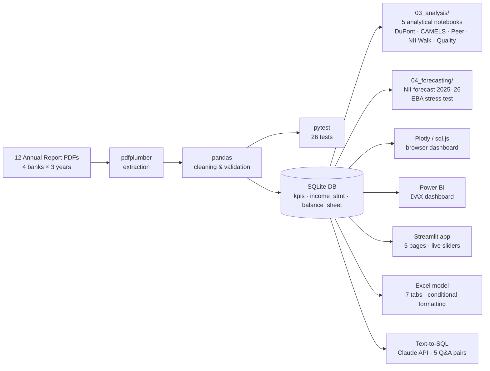

# Greek Banking Sector Analysis 2022–2024

> Investment-grade financial analysis of the four Greek systemic banks — built entirely from official annual report PDFs, with 5-step DuPont decomposition, CAMELS scoring, peer benchmarking, NII forecasting, and EBA-style stress testing.

[](https://greek-banking-sector-analysis.streamlit.app/)
[](https://phytai.com/dashboard/)


---

### Why I built this

Greek banking sector analysis requires sourcing data from 12 separate PDFs in three languages, reconciling non-standardised line items across four banks, and building the analytical framework from first principles — no Bloomberg terminal, no paid data vendor. I built this to demonstrate that investment-grade equity research is reproducible with open-source tools and public data, and to apply the kind of financial modelling I'd do as a junior analyst at a fund or advisory firm.

The specific question I was trying to answer: *"Which Greek bank is best positioned heading into the ECB rate-cutting cycle — and which one is the most earnings-quality risk?"* The answer is in `03_analysis/00_executive_summary.ipynb`.

---

### Headline result

**Sector NII grew +55% (2022→2024)** driven almost entirely by ECB rate hikes — the NIM × Assets decomposition (notebook `03_analysis/04`) confirms that the rate/spread effect accounted for >90% of NII growth in 2022→2023. Yet under EBA-style stress (+200bps cost of risk, −15% loan volume, −50bps NIM), Piraeus Bank's CET1 would fall to 9.9% — below the ECB regulatory minimum of 10.5%.


---

### What this project demonstrates

| Skill | Where |
|-------|-------|
| **SQL** — window functions, CTEs, JOIN, GROUP BY | `01_eurobank_pipeline/` |
| **Python / pandas** — ETL, tidy-data transforms, financial modelling | All notebooks |
| **PDF data extraction** — pdfplumber, table parsing from 12 annual reports | `02_Banking_Sector_Dashboard/notebooks/01_extract.ipynb` |
| **Financial modelling** — 5-step DuPont, CAMELS, NIM decomposition, OLS forecasting | `03_analysis/` |
| **Equity valuation** — P/B vs justified P/B (Gordon Growth), CoE estimation, investment signals | `02_Banking_Sector_Dashboard/index.html` |
| **Credit quality analysis** — NPE ratio extraction from 12 PDFs, 3-year cleanup trend | `02_Banking_Sector_Dashboard/data/processed/kpis_final.csv` |
| **Capital return analysis** — dividend restart, payout ratios, SREP buffer headroom | `02_Banking_Sector_Dashboard/index.html` |
| **Scenario analysis & stress testing** — EBA-style adverse scenario, CET1 impact | `04_forecasting/02_stress_test.ipynb` |
| **Data quality engineering** — pytest suite (26 tests), balance sheet identity checks | `tests/test_kpis.py` |
| **Statistical analysis** — z-scores, percentile ranking, regression | `03_analysis/03_peer_benchmarking.ipynb` |
| **BI & dashboards** — Power BI with DAX measures + browser-native Plotly/sql.js app | `01_eurobank_pipeline/powerbi/`, `02_Banking_Sector_Dashboard/index.html` |
| **Interactive app** — Streamlit multi-page app with live ECB scenario sliders and stress test | `05_streamlit_app/` |
| **Excel financial model** — 7-tab workbook: Cover, Sector Summary, one tab per bank, Assumptions | `deliverables/greek_banking_model.xlsx` |
| **Text-to-SQL / AI fluency** — natural-language queries answered by Claude API against SQLite DB | `06_llm_qa/01_text_to_sql.ipynb` |

---

### Data architecture



---

### Running the Streamlit app

**Live:** [https://greek-banking-sector-analysis.streamlit.app/](https://greek-banking-sector-analysis.streamlit.app/)

Or run locally:
```bash
pip install -r requirements.txt
streamlit run 05_streamlit_app/app.py
```

Pages: **Overview** · **Bank Deep-Dive** · **Peer Comparison** · **Forecast & Stress** · **Methodology**

The Forecast & Stress page lets you dial ECB rate scenarios and adjust CoR / loan growth / NIM compression sliders to see real-time CET1 impact — including Piraeus breaching the 10.5% SREP floor under EBA adverse parameters.

---

### Running the tests

```bash
pip install -r requirements.txt
pytest tests/ -v
# → 26 passed in ~1s
```

---

## Project 1 — Eurobank Single-Bank Pipeline

Full extract → clean → load → query → visualise pipeline for Eurobank (2022–2024).

### Pipeline

| Step | Tool | Description |
|:-----|:-----|:------------|
| 1. Extract | Python · pdfplumber | Financial tables extracted directly from official Annual Report PDFs |
| 2. Clean | pandas | Structured and normalised P&L and Balance Sheet data |
| 3. Load | SQLite | Loaded into a relational database with 2 tables |
| 4. Query | SQL | KPI calculations using SELECT, JOIN, GROUP BY, Window Functions |
| 5. Analyse | Python · pandas | YoY trends, ROE, Cost-to-Income, Loan-to-Deposit ratios |
| 6. Visualise | Power BI · DAX | Interactive dashboard with slicers and custom DAX measures |

### Dashboard Preview


### Key Findings

| KPI | 2022 | 2023 | 2024 |
|:----|-----:|-----:|-----:|
| Net Interest Income | €1,551m | €2,174m | €2,504m |
| Operating Income | €3,135m | €2,914m | €3,339m |
| Net Profit | €1,336m | €1,148m | €1,458m |
| Cost-to-Income | 29.0% | 31.1% | 32.6% |
| Loan-to-Deposit | 72.7% | 71.9% | 64.6% |
| ROE | 20.0% | 15.2% | 16.9% |

> **Note:** 2022 Operating Income includes €727m one-time trading gains and €324m other income, which suppresses the 2022 Cost-to-Income ratio. Underlying recurring C/I normalises to ~32–33% from 2023 onward.

**Insights**
- **NII +61%** over 2 years — driven by higher interest rates and strong loan growth
- **Cost-to-Income 32.6%** in 2024 — well below the European banking average of ~55%
- **Loan-to-Deposit 64.6%** (2024) — conservative liquidity position, well below the 80% threshold
- **ROE 16.9%** in 2024 — above the European banking average (~11%)
- **Net Profit +27% YoY** in 2024 despite ECB rate cuts beginning in June 2024

### SQL Highlights

```sql
-- Cost-to-Income Ratio trend
SELECT
    'Cost-to-Income Ratio' AS kpi,
    ROUND(ABS(value_2022) * 100.0 / 3135, 1) AS ratio_2022,
    ROUND(ABS(value_2023) * 100.0 / 2914, 1) AS ratio_2023,
    ROUND(ABS(value_2024) * 100.0 / 3339, 1) AS ratio_2024
FROM income_statement
WHERE metric = 'Operating expenses';

-- NII YoY Growth with Window Function
WITH yearly AS (
    SELECT metric, value_2022 AS val, '2022' AS year FROM income_statement
    WHERE metric = 'Net interest income'
    UNION ALL
    SELECT metric, value_2023, '2023' FROM income_statement
    WHERE metric = 'Net interest income'
    UNION ALL
    SELECT metric, value_2024, '2024' FROM income_statement
    WHERE metric = 'Net interest income'
)
SELECT year,
       val AS net_interest_income,
       ROUND((val - LAG(val) OVER (ORDER BY year)) * 100.0 /
             LAG(val) OVER (ORDER BY year), 1) AS yoy_growth_pct
FROM yearly;

-- Executive KPI Summary using JOIN
SELECT 'ROE 2024' AS kpi,
    ROUND(
        (SELECT value_2024 FROM income_statement
         WHERE metric = 'Net profit attributable to shareholders') * 100.0 /
        (SELECT value_2024 FROM balance_sheet
         WHERE metric = 'Total equity'), 1
    ) || '%' AS value
UNION ALL
SELECT 'Cost-to-Income 2024',
    ROUND(ABS(
        (SELECT value_2024 FROM income_statement WHERE metric = 'Operating expenses')) * 100.0 /
        (SELECT value_2024 FROM income_statement WHERE metric = 'Operating income'), 1
    ) || '%'
UNION ALL
SELECT 'Loan-to-Deposit 2024',
    ROUND(
        (SELECT value_2024 FROM balance_sheet
         WHERE metric = 'Loans and advances to customers') * 100.0 /
        (SELECT value_2024 FROM balance_sheet
         WHERE metric = 'Deposits from customers'), 1
    ) || '%';
```

---

## Project 2 — Greek Banking Sector Dashboard

Interactive web dashboard comparing all four Greek systemic banks: **Eurobank, Alpha Bank, Piraeus Bank, NBG**.

Data extracted from 12 official annual report PDFs (4 banks × 3 years) using the same Python/pdfplumber pipeline. Results stored in SQLite and rendered as a fully client-side dashboard using Plotly and sql.js.

Open `02_Banking_Sector_Dashboard/index.html` in a browser — no server required.

### Sector Snapshot (2024, € million)

| Bank | NII | Net Profit | Total Assets | ROE |
|:-----|----:|-----------:|-------------:|----:|
| Eurobank | 2,504 | 1,458 | 101,151 | 16.9% |
| NBG | 2,356 | 1,158 | 74,957 | 13.7% |
| Piraeus Bank | 2,088 | 1,066 | 80,044 | 12.9% |
| Alpha Bank | 1,646 | 668 | 70,954 | 8.2% |

**Insights**
- **Sector NII +55%** from 2022 to 2024 (€5.5bn → €8.6bn) — rate cycle tailwind across all four banks
- **NPE cleanup complete**: sector NPE ratios fell from 5–8% (2022) to 2.6–3.8% (2024), verified from 12 annual report PDFs
- **Eurobank leads** on ROE (16.9%) and M&A execution; NBG leads on capital strength (CET1 19.1%, ROA 1.54%)
- **Piraeus most cost-efficient** in 2024 — Cost-to-Income 31.8%, down from 34.5% in 2022
- **All four banks resumed dividends** after a decade of suspension — payout ratios 18–50% of 2024 profits
- **Valuation**: NBG and Eurobank trade near justified P/B (ROE/CoE); Alpha's 8.2% ROE remains below its 11% cost of equity

---

## Repository Structure

```
Greek_Banking_Sector_Analysis/
│
├── 01_eurobank_pipeline/          ← Project 1: single-bank deep-dive
│   ├── data/                      ← Eurobank IS, BS (wide + long format), SQLite
│   └── powerbi/                   ← .pbix, dashboard PNG, PDF export
│
├── 02_Banking_Sector_Dashboard/   ← Project 2: 4-bank sector analysis
│   ├── data/
│   │   ├── processed/             ← kpis_final.csv, income_statement_final.csv, balance_sheet_final.csv
│   │   ├── raw/                   ← 12 source PDFs (4 banks × 3 years)
│   │   └── greek_banking_final.db ← SQLite (3 tables, indexed)
│   ├── notebooks/
│   │   ├── 01_extract.ipynb       ← Full ETL pipeline: PDF → SQLite
│   │   └── 02_advanced_analysis.ipynb ← 3-step DuPont, NIM, C/I, peer heatmap
│   ├── index.html                 ← Plotly + sql.js browser dashboard (no server needed)
│   └── rebuild_db.py              ← Rebuilds SQLite from CSVs
│
├── 03_analysis/                   ← Investment-grade analytical layer
│   ├── 00_executive_summary.ipynb      ← Investment implications, NIM scenarios, risk matrix
│   ├── 01_dupont_decomposition.ipynb   ← 5-step banking DuPont (all 4 banks × 3 years)
│   ├── 02_camels_scorecard.ipynb       ← CAMELS 1–5 rating heatmap
│   ├── 03_peer_benchmarking.ipynb      ← Z-score, percentile ranks, radar charts
│   ├── 04_nii_rate_volume_walk.ipynb   ← NIM × Assets rate/volume decomposition
│   └── 05_earnings_quality.ipynb       ← One-off stripping: reported vs underlying ROE
│
├── 04_forecasting/                ← Forecasting and scenario analysis
│   ├── 01_forecast_nii_2025_2026.ipynb ← OLS NII forecast, ECB scenario fan charts
│   └── 02_stress_test.ipynb            ← EBA-style adverse scenario, CET1 impact
│
├── tests/
│   └── test_kpis.py               ← pytest suite: 26 tests (KPI re-derivation, BS identity, sanity)
│
├── requirements.txt               ← Python dependencies (pandas, plotly, pytest, scipy, ...)
└── README.md
```

---

## Tools & Technologies

`Python` `pandas` `pdfplumber` `SQLite` `SQL` `Plotly` `sql.js` `Power BI` `DAX` `Jupyter Notebook`

---

## Data Sources

**Eurobank:** Official Annual Reports 2022–2024 — [investor-relations](https://www.eurobank.gr/en/group/investor-relations)

**Alpha Bank:** Official Annual Reports 2022–2024 — [investor-relations](https://www.alpha.gr/en/group/investor-relations)

**Piraeus Bank:** Official Annual Reports 2022–2024 — [investor-relations](https://www.piraeusbankgroup.com/en/investors)

**NBG:** Official Annual Reports 2022–2024 — [investor-relations](https://www.nbg.gr/en/the-group/investor-relations)

All figures in € million.

---

## Methodology

### Data Extraction Pipeline

| Step | Description | Tools |
|:-----|:-------------|:------|
| 1. **PDF Collection** | Downloaded official Annual Reports (2022-2024) for all 4 systemic banks from their investor relations portals | Manual download |
| 2. **Table Extraction** | Identified and extracted financial tables from PDF reports using programmatic parsing | `pdfplumber` |
| 3. **Data Cleaning** | Normalized column names, handled missing values, standardized units (€ millions) | `pandas` |
| 4. **Data Validation** | Cross-checked all key line items against source PDFs; corrected extraction errors | Python + manual verification |
| 5. **Database Loading** | Loaded cleaned data into SQLite for efficient querying | `sqlite3` |
| 6. **KPI Calculation** | Computed derived metrics (ROE, Cost-to-Income, NIM, YoY growth) using SQL | SQL + pandas |
| 7. **Visualization** | Built interactive dashboard using Plotly + sql.js | Plotly, sql.js |

### KPI Definitions

| KPI | Formula | Notes |
|:----|:--------|:------|
| ROE | Net Profit / Total Equity × 100 | Uses year-end total equity |
| ROA | Net Profit / Total Assets × 100 | Uses year-end total assets |
| Cost-to-Income | \|Operating Expenses\| / Operating Income × 100 | Operating income includes trading gains |
| NIM | Net Interest Income / Total Assets × 100 | Year-end assets as denominator |
| Loan-to-Deposit | Loans / Customer Deposits × 100 | Net loans (post-ECL) |
| CET1 | Common Equity Tier 1 / Risk-Weighted Assets × 100 | As disclosed in Annual Report capital adequacy section |
| NPE Ratio | Non-Performing Exposures / Gross Loans × 100 | Extracted from credit risk disclosures in each annual report |
| Justified P/B | ROE / Cost of Equity | Gordon Growth Model; CoE = 11% (Rf 3.5% + β×ERP 5.5% + CRP 2%) |
| NII YoY | (NII_t − NII_{t-1}) / NII_{t-1} × 100 | — |

### Data Quality Notes

- **Source**: Official annual reports published by each bank
- **Frequency**: Annual (calendar year)
- **Currency**: Euros (€)
- **Units**: Millions unless otherwise stated
- **Coverage**: 4 Greek systemic banks × 3 years (2022-2024)
- **Validation**: All IS and BS line items manually cross-checked against source PDF pages

### Limitations

1. **Annual only**: No quarterly data in this version
2. **Static data**: Requires manual refresh when new reports are published
3. **NIM denominator**: Uses year-end total assets rather than average earning assets — understates NIM relative to bank-reported figures
4. **P/B valuation**: Market P/B figures are estimated (end-2024 approximations) — live share price integration would improve precision

### Running from scratch

**Prerequisites:** Python 3.9+, pip, Jupyter

> **Note on raw data:** The 12 annual report PDFs are not included in this repo (file size). Download them from each bank's investor relations portal (links in Data Sources above) and place them in `02_Banking_Sector_Dashboard/data/raw/`. The processed CSVs and SQLite DB **are** included — steps 1–2 below can be skipped if you trust the existing processed data.

```bash
# 1. Clone and install
git clone https://github.com/papastergiousp-maker/greek-banking-sector-analysis.git
cd greek-banking-sector-analysis
pip install -r requirements.txt

# 2. (Optional) Re-run the PDF extraction pipeline
jupyter nbconvert --to notebook --execute \
  02_Banking_Sector_Dashboard/notebooks/01_extract.ipynb
# → writes kpis_final.csv, income_statement_final.csv, balance_sheet_final.csv
#   to 02_Banking_Sector_Dashboard/data/processed/

# 3. Rebuild the SQLite database from processed CSVs
python 02_Banking_Sector_Dashboard/rebuild_db.py
# → writes greek_banking_final.db (~120 KB)

# 4. Validate data quality (26 tests, ~1s)
pytest tests/ -v
# Expected: 26 passed

# 5. Run the analytical notebooks (execute in order)
jupyter nbconvert --to notebook --execute --inplace 03_analysis/00_executive_summary.ipynb
jupyter nbconvert --to notebook --execute --inplace 03_analysis/01_dupont_decomposition.ipynb
jupyter nbconvert --to notebook --execute --inplace 03_analysis/02_camels_scorecard.ipynb
jupyter nbconvert --to notebook --execute --inplace 03_analysis/03_peer_benchmarking.ipynb
jupyter nbconvert --to notebook --execute --inplace 03_analysis/04_nii_rate_volume_walk.ipynb
jupyter nbconvert --to notebook --execute --inplace 03_analysis/05_earnings_quality.ipynb
# Each notebook prints: ✅ All checks passed

# 6. Run the forecasting notebooks
jupyter nbconvert --to notebook --execute --inplace 04_forecasting/01_forecast_nii_2025_2026.ipynb
jupyter nbconvert --to notebook --execute --inplace 04_forecasting/02_stress_test.ipynb

# 7. Open the static dashboard (no server needed — runs entirely client-side via sql.js)
#    Windows:  start 02_Banking_Sector_Dashboard/index.html
#    macOS:    open  02_Banking_Sector_Dashboard/index.html
#    Linux:    xdg-open 02_Banking_Sector_Dashboard/index.html
#    Or visit: https://phytai.com/dashboard

# 8. Run the interactive Streamlit app (live ECB scenarios + stress test sliders)
streamlit run 05_streamlit_app/app.py
```

---

## Data Dictionary

See [DATA_DICTIONARY.md](02_Banking_Sector_Dashboard/data/DATA_DICTIONARY.md) for detailed field descriptions.

---

---

## What I learned / would do differently

**What worked well:**
- Treating the data extraction as a proper ETL (not just manual copy-paste) forced early decisions about data quality that paid off later
- The pytest suite caught three real calculation bugs before they reached the dashboard — validation is not optional in financial modelling
- Building the browser dashboard with `sql.js` (client-side SQLite) was a deliberate choice: zero server cost, zero maintenance, easy to share — the right tool for a static portfolio artefact

**What I'd do differently with more time:**
- Replace the annual-only data with quarterly reports — this would enable proper rate/volume decomposition and a more accurate NIM forecast
- Integrate live share price data via a free API to replace the estimated end-2024 P/B figures with real-time valuations
- Add Pillar 3 disclosure parsing to extract bank-specific rate sensitivity data (€ NII impact per 25bp ECB cut) — currently estimated at sector level

---

## About the analyst

**Spyros Papastergiou** — Financial & Data Analyst  
Focused on European banking sector analysis, data engineering, and quantitative financial modelling.

[](https://linkedin.com/in/spyros-papastergiou)
[](mailto:spyrossyo96@gmail.com)

---

*Greek Banking Sector Analysis 2022–2024 | Data sourced exclusively from official annual reports*
